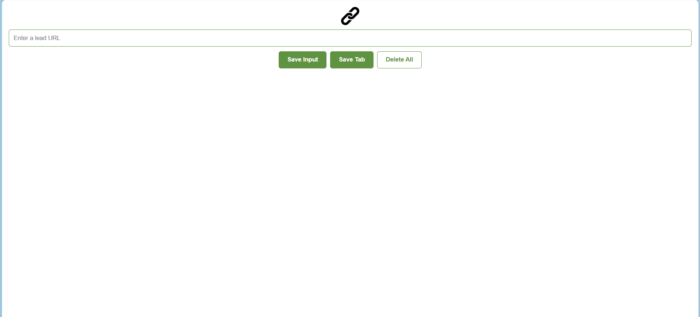

# Lead Tracker Chrome Extension

**Lead Tracker Chrome Extension** – A lightweight Chrome extension to save and manage website leads quickly. Enter URLs manually or save the current tab, prevent duplicates, store leads in local storage, and delete all safely with a double-click.

## Features
- Save leads manually or from the current tab
- Prevent duplicate entries
- Persistent storage in localStorage
- Delete all leads safely with a double-click
- Clean and minimal UI

## Demo

## Installation
1. Download or clone this repository.
2. Open Chrome and go to `chrome://extensions/`.
3. Enable **Developer Mode**.
4. Click **Load unpacked** and select the project folder.
5. Use the extension from your Chrome toolbar.

## Usage
- **Save Input:** Enter a URL and click **Save Input**.
- **Save Tab:** Click **Save Tab** to save the active tab.
- **Delete All:** Double-click **Delete All** to clear all leads.
## Project Structure

